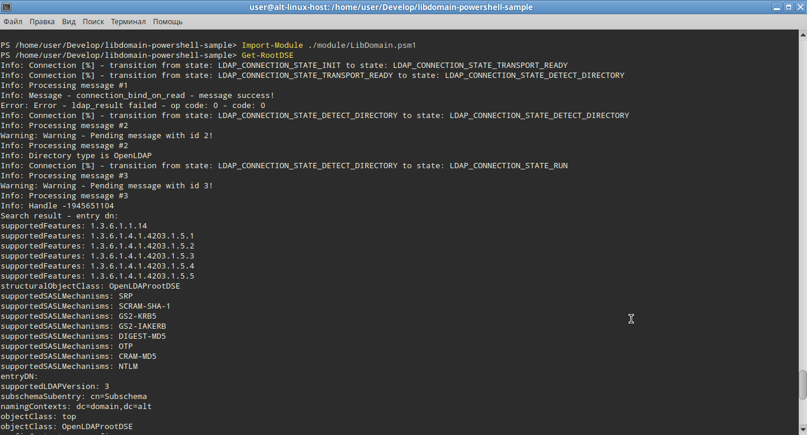

# Пример программы поиска LDAP с использованием библиотеки libdomain и PowerShell

# Как построить библиотеку libdomain и модули PowerShell

## 1) Установка PowerShell на Linux

Чтобы построить библиотеку libdomain и модули PowerShell на Linux, сначала необходимо установить PowerShell. Вы можете следовать этим шагам:

- Посетите официальную страницу выпусков PowerShell на GitHub: [Релизы PowerShell](https://github.com/PowerShell/PowerShell/releases)
- Скачайте соответствующий пакет для вашего дистрибутива Linux.
- Следуйте инструкциям по установке, предоставленным для вашего конкретного дистрибутива.

В качестве альтернативы на дистрибутиве Alt-Linux выполните следующую команду:

```bash
apt-get install powershell
```

## 2) Установка .NET и SDK на Linux

После установки PowerShell вам нужно настроить среду .NET и необходимые SDK. Выполните следующие шаги:

- Посетите официальную страницу загрузки .NET: [Загрузка .NET](https://dotnet.microsoft.com/download)
- Скачайте и установите SDK .NET для Linux.
- Обязательно следуйте дополнительным инструкциям по настройке, предоставленным для вашего дистрибутива.

В качестве альтернативы на дистрибутиве Alt-Linux просто выполните следующую команду:

```bash
apt-get install dotnet-sdk-7.0
```

## 3) Построение нативного модуля

Для компиляции программы вам необходимо установить библиотеку libdomain.

```bash
apt-get install git libdomain-devel libconfig-devel cmake rpm-build glib2-devel
```

Клонируйте пример:

```bash
git clone https://github.com/libdomain/libdomain-powershell-sample && cd libdomain-powershell-sample
```

Для построения нативного модуля для libdomain выполните следующие шаги:

```bash
cd native && mkdir build && cd build && cmake .. && make -j `nproc`
```

## 4) Построение модуля на C#

Построение модуля на C# для PowerShell включает использование .NET SDK. Вот базовый план:

```bash
cd src && dotnet build
```

## 5) Объединение модулей

После построения нативного и C# модулей, возможно, потребуется объединить их. Для этого скопируйте бинарные модули в папку bin.

```bash
cp native/build/libdomain_wrapper.so ./bin/ && cp src/bin/Debug/net7.0/LibDomain.dll ./bin/
```

Теперь вы готовы к использованию.

# Как использовать

Для этого примера предполагаем, что у пользователя есть сервер OpenLDAP,
работающий на локальном хосте на порту 3890 с simple authentication.
В целях упрощения примера данные для подключения содержатся в файле native/main.c вы можете изменить их при необходимости для работы со своим LDAP сервером.

Обратитесь к инструкции по настройке сервера LDAP если вам необходимо настроить LDAP сервер.

## 1) Запуск сценариев

Чтобы использовать созданные вами сценарии и модули, следуйте этим общим шагам:

```bash
powershell
```

```powershell
Import-Module ./module/LibDomain.psm1
Get-RootDSE
```



## Описание
Программа состоит из следующих модулей:

1. **LibDomain.dll**
   Обертка для нативной библиотеки libdomain_wrapper.so предоставляет возможность импорта функций из нативной библиотеки.
   Вы можете найти исходные коды для этого модуля в папке `src`.
2. **libdomain_wapper.so**
   Расположенный в папке `native` этот модуль загружает libdomain и предоставляет функцию `get_root_dse`.
   Эта функция затем вызывается из `LibDomain.dll`.
3. **Сценарии PowerShell**
   Размещенный в каталоге module, этот сценарий импортирует `LibDomain.dll` и вызывают `[LibDomain.Native]::get_root_dse()` из него.

## Дополнительная информация

Вот несколько полезных статей:
- https://stackoverflow.com/questions/2167895/howto-implement-callback-interface-from-unmanaged-dll-to-net-app
- https://www.codeproject.com/Articles/19354/Quick-C-CLI-Learn-C-CLI-in-less-than-10-minutes
- https://old.reddit.com/r/PowerShell/comments/pznw2c/can_powershell_load_so_by_addtype_c_file_on_linux/?rdt=47785
- https://github.com/jborean93/omi/blob/main/PSWSMan/src/Native.cs
- https://www.powershellgallery.com/packages/PoshInternals/1.0.34/Content/Interop.ps1
- https://learn.microsoft.com/en-us/powershell/module/microsoft.powershell.core/import-module?view=powershell-7.4

## Информация о версии

- Версия программы: 1.0.0

## Лицензия

Эта программа распространяется по лицензии GPLv2. См. сопроводительный файл LICENSE.md для подробной информации.

