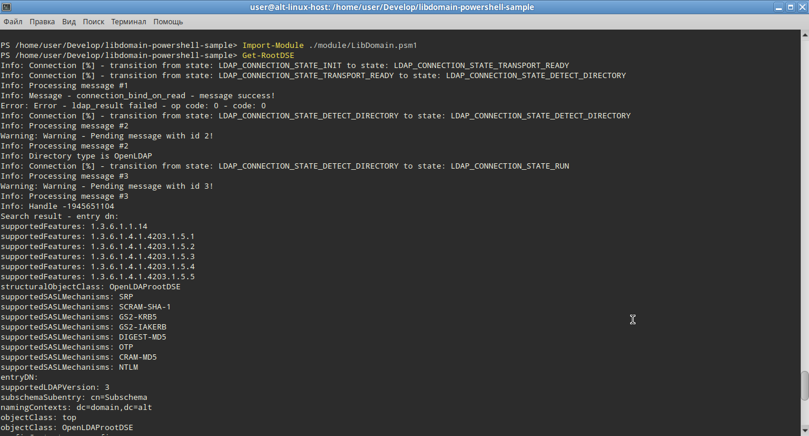

# LDAP Search Example Program using the libdomain Library and PowerShell

# How to Build libdomain and PowerShell Modules

## 1) Installing PowerShell on Linux

To build libdomain and PowerShell modules on Linux, you first need to install PowerShell. You can follow these steps:

- Visit the official PowerShell GitHub releases page: [PowerShell Releases](https://github.com/PowerShell/PowerShell/releases)
- Download the appropriate package for your Linux distribution.
- Follow the installation instructions provided for your specific distribution.

Alternatively on Alt-linux distribution run following command:

```bash
apt-get install powershell
```

## 2) Installing .NET and SDKs on Linux

After installing PowerShell, you'll need to set up the .NET environment and the necessary SDKs. Follow these steps:

- Visit the official .NET download page: [Download .NET](https://dotnet.microsoft.com/download)
- Download and install the .NET SDK for Linux.
- Make sure to follow any additional setup instructions provided for your distribution.

Alternatively on Alt-linux distribution simply run following command:

```bash
apt-get install dotnet-sdk-7.0
```

## 3) Building Native Module

To compile the program, you need to install the libdomain library.

```bash
apt-get install git libdomain-devel libconfig-devel cmake rpm-build glib2-devel
```

Clone the example:

```bash
git clone https://github.com/libdomain/libdomain-powershell-sample && cd libdomain-powershell-sample
```

To build the native module for libdomain, follow these steps:

```bash
cd native && mkdir build && cd build && cmake .. && make -j `nproc`
```

## 4) Building C# Module

Building a C# module for PowerShell involves using the .NET SDK. Here's a basic outline:

```bash
cd ../../src && dotnet build
```

## 5) Combining Modules

Once you have built the native and C# modules, you may need to combine them. To do so copy binary modules in bin folder.

```bash
cd .. && cp native/build/libdomain_wrapper.so ./bin/ && cp src/bin/Debug/net7.0/LibDomain.dll ./bin/
```

Now you good to go.

# How to Use

For this example we assume user has OpenLDAP server running locally on localhost's port 3890 with simple authentication.
For the sake of simplicity our example application has this values hardcoded in native/main.c you can change them according to your setup. 

Please refer to LDAP server manual of how to setup server if you plan to use example with different LDAP server.

## 1) Launching Scripts

To use the scripts and modules you've built, follow these general steps:

```bash
powershell
```

```powershell
Import-Module ./module/LibDomain.psm1
Get-RootDSE
```




## Description
The program consists of the following modules:

1. **LibDomain.dll**
   Wrapper to native library libdomain_wrapper.so provides ability to import functions from native libary.
   You can find sources for that module in `src` folder.
2. **libdomain_wapper.so**
   Located in the native folder this module loads libdomain and provides `get_root_dse` function.
   This function then will be called from `LibDomain.dll`.
3. **Power shell scripts**
   Placed in module directory this scripts import `LibDomain.dll` and call `[LibDomain.Native]::get_root_dse()` from it.

## Additional information

Here are some usefull articles:
- https://stackoverflow.com/questions/2167895/howto-implement-callback-interface-from-unmanaged-dll-to-net-app
- https://www.codeproject.com/Articles/19354/Quick-C-CLI-Learn-C-CLI-in-less-than-10-minutes
- https://old.reddit.com/r/PowerShell/comments/pznw2c/can_powershell_load_so_by_addtype_c_file_on_linux/?rdt=47785
- https://github.com/jborean93/omi/blob/main/PSWSMan/src/Native.cs
- https://www.powershellgallery.com/packages/PoshInternals/1.0.34/Content/Interop.ps1
- https://learn.microsoft.com/en-us/powershell/module/microsoft.powershell.core/import-module?view=powershell-7.4

## Version Information

- Program Version: 1.0.0

## License

This program is distributed under the GPLv2 license. See the accompanying LICENSE file for detailed information.
